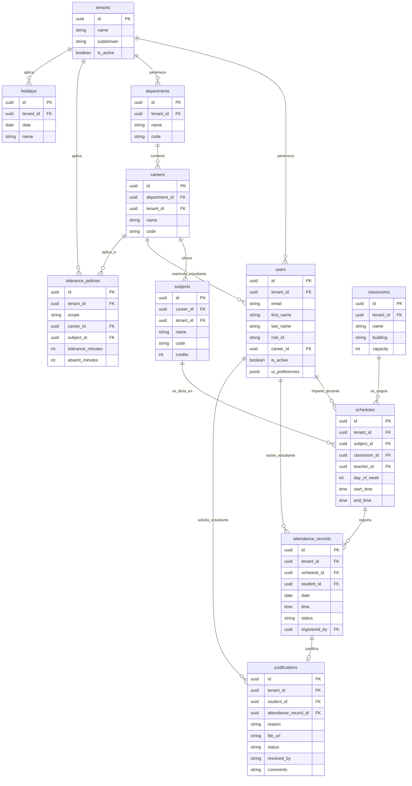

# INFORME TÉCNICO: SISTEMA WEB DE CONTROL DE ASISTENCIA ACADÉMICO (AsistApp)

---

## 1. Portada

**INSTITUCIÓN:** Universidad de Deymos  
**PROYECTO:** AsistApp - Sistema Web de Control de Asistencia Académico  
**CARRERA:** Ingeniería de Sistemas  
**MATERIA:** Proyecto Integrador de Sistemas  

**INTEGRANTES DEL EQUIPO (DESARROLLADORES):**
*   **Brenda Marina Pérez** (Usuario Git: `brendamarinaperez2-source`) - *Backend Core & DB Architect*
*   **Juan José** (Usuario Git: `jj19721971-dev`) - *Database & API Refactoring*
*   **Julio** (Usuario Git: `j170396`) - *Frontend Engineer*
*   **SRLP1989** (Usuario Git: `SRLP1989`) - *DevOps, Integrator & Database Administrator*

**FECHA DE ENTREGA:** Julio de 2026  

---

## 2. Índice

1.  **Portada**
2.  **Índice**
3.  **Introducción**
4.  **Objetivos**
    *   *Objetivo General*
    *   *Objetivos Específicos*
5.  **Descripción del Proyecto**
6.  **Tecnologías Utilizadas**
    *   *Frontend*
    *   *Backend*
    *   *Base de Datos y Autenticación*
    *   *Infraestructura y Herramientas*
7.  **Arquitectura del Sistema**
8.  **Diagrama de la Base de Datos**
9.  **Explicación de cada Módulo**
    *   *Módulo de Autenticación y Autorización*
    *   *Módulo de Asistencia (Lógica Dinámica)*
    *   *Módulo de Justificaciones*
    *   *Módulo de Reportes y Estadísticas*
    *   *Módulo de Notificaciones y Alertas SaaS*
10. **Capturas de Pantalla (Propuesta de Interfaz)**
11. **Problemas Encontrados y Soluciones**
12. **Conclusiones**
13. **Bibliografía**

---

## 3. Introducción

En el contexto educativo contemporáneo, el seguimiento de la asistencia estudiantil es un factor crítico que impacta directamente en el rendimiento académico, la retención de alumnos y el cumplimiento de las regulaciones institucionales. Tradicionalmente, este proceso se ha llevado a cabo de forma manual mediante planillas físicas o registros en papel, lo cual es propenso a errores, pérdidas de datos y carece de inmediatez para la toma de decisiones.

**AsistApp** nace como una solución de software moderna y escalable que digitaliza y automatiza el control de asistencia. Concebido como una plataforma de software como servicio (SaaS) multi-inquilino (multi-tenant), el sistema permite a diferentes instituciones gestionar su propio catálogo de alumnos, profesores, materias, aulas y periodos académicos de manera aislada, automatizando la aplicación de políticas de puntualidad personalizadas y facilitando la justificación de inasistencias en tiempo real.

---

## 4. Objetivos

### Objetivo General
Desarrollar e implementar un sistema web integral (SaaS) para el control de asistencia académica que automatice el registro diario, valide conflictos de horarios, procese justificaciones digitales y genere alertas automáticas ante altos índices de ausentismo, garantizando integridad en los datos y una experiencia fluida para administradores, docentes y estudiantes.

### Objetivos Específicos
1.  Diseñar una base de datos relacional robusta con aislamiento de inquilinos (Tenants) mediante políticas de seguridad a nivel de fila (RLS).
2.  Desarrollar un backend transaccional en NestJS usando Prisma ORM para garantizar consultas eficientes y seguras a la base de datos PostgreSQL.
3.  Implementar una interfaz de usuario interactiva y responsiva en Next.js (utilizando Tailwind CSS y framer-motion) adaptada a dispositivos móviles y de escritorio.
4.  Codificar algoritmos de validación en tiempo real para evitar que un docente registre asistencia en horarios conflictivos o feriados institucionales.
5.  Desplegar un módulo de justificaciones digitales que permita adjuntar sustentos médicos o personales para su revisión y aprobación por parte de la supervisión académica.

---

## 5. Descripción del Proyecto

AsistApp es una plataforma SaaS multi-tenant diseñada para el sector educativo. Permite el aislamiento de datos por institución (inquilino), lo que significa que múltiples universidades o colegios pueden utilizar la misma infraestructura sin riesgo de fugas de información.

El sistema se estructura en torno a cuatro roles de usuario claramente definidos, cada uno con un panel de control personalizado y permisos específicos regulados por RLS:

*   **Administrador / Director:** Administra la configuración global de la institución, gestiona el catálogo de usuarios, departamentos y carreras, y establece los parámetros generales de tolerancia de asistencia.
*   **Supervisor Académico:** Monitorea de manera agregada la asistencia de toda la institución, audita el comportamiento de los alumnos y tiene la facultad de revisar, aprobar o rechazar las solicitudes de justificación.
*   **Docente:** Registra la asistencia diaria de sus estudiantes en las materias asignadas. La interfaz le presenta únicamente las clases activas en el momento actual para evitar registros erróneos.
*   **Estudiante:** Consulta su porcentaje de asistencia por materia, visualiza las inasistencias acumuladas y envía solicitudes de justificación digital cargando archivos o motivos específicos.

---

## 6. Tecnologías Utilizadas

El sistema fue desarrollado bajo un enfoque moderno de monorepo utilizando `pnpm workspaces` para estructurar la base de código.

### Frontend
*   **Next.js 16.2.6 (App Router):** Framework principal de React para la entrega y enrutamiento del lado del cliente.
*   **Tailwind CSS & PostCSS:** Framework de diseño para una interfaz responsiva, limpia y con estética premium.
*   **Zustand:** Manejo de estado global ligero y reactivo para la sesión de usuario y preferencias de la interfaz.
*   **Framer Motion:** Animación micro-interactiva para transiciones suaves en modales y paneles.
*   **Lucide Icons:** Conjunto de iconos vectoriales consistentes y modernos.

### Backend
*   **NestJS:** Framework progresivo de Node.js estructurado bajo arquitectura modular para construir servicios REST robustos.
*   **Prisma ORM:** Mapeador objeto-relacional para interactuar con PostgreSQL mediante consultas tipadas, eliminando consultas SQL manuales propensas a inyecciones.
*   **Swagger (OpenAPI):** Generación automática de la documentación técnica e interactiva de la API.
*   **Passport.js & JWT:** Estrategia de seguridad y autenticación mediante Tokens Bearer para resguardar los endpoints expuestos.

### Base de Datos y Autenticación
*   **Supabase (PostgreSQL):** Base de datos relacional con soporte nativo de extensiones geoespaciales y de UUIDs.
*   **Row Level Security (RLS):** Mecanismo de políticas en la base de datos que restringe el acceso a las filas de las tablas según el `tenant_id` del usuario autenticado.

### Infraestructura y Herramientas
*   **Docker & Docker Compose:** Contenedores para el despliegue local de la base de datos, la API Gateway, el panel Studio y los servicios de autenticación de Supabase.
*   **Postman:** Colección de endpoints para validar y documentar los casos de prueba del API REST.

---

## 7. Arquitectura del Sistema

El sistema utiliza una arquitectura modular desacoplada basada en microservicios lógicos dentro de un monorepo:

```
  ┌────────────────────────────────────────────────────────┐
  │                   CLIENTE (Next.js)                    │
  │  - Renderizado del lado del cliente (CSR)             │
  │  - Consumo del API REST / Manejo de Sesión (Zustand)   │
  └──────────────────────────┬─────────────────────────────┘
                             │ Peticiones HTTPS (Bearer JWT)
                             ▼
  ┌────────────────────────────────────────────────────────┐
  │                 BACKEND API (NestJS)                   │
  │  - Autenticación Passport JWT                          │
  │  - Controladores (Endpoints REST) & Swagger Docs       │
  │  - Lógica de Negocio (Asistencia, Feriados, Alertas)   │
  │  - Prisma Client                                       │
  └──────────────────────────┬─────────────────────────────┘
                             │ Prisma ORM (TCP)
                             ▼
  ┌────────────────────────────────────────────────────────┐
  │                BASE DE DATOS (Postgres)                │
  │  - PostgreSQL + Extensiones (uuid-ossp)                │
  │  - Tablas Relacionales (Prisma Schema)                 │
  │  - Políticas RLS por Tenant                            │
  └────────────────────────────────────────────────────────┘
```

---

## 8. Diagrama de la Base de Datos

A continuación se detalla el esquema relacional de la base de datos de AsistApp, ilustrando las conexiones clave y llaves foráneas:



---

## 9. Explicación de cada Módulo

### Módulo de Autenticación y Autorización
Administra el flujo de inicio de sesión utilizando Supabase Auth para resguardar la autenticación de usuarios. El backend valida el Token JWT en cada petición. 
*   **Triggers en BD:** Al crearse un usuario en `auth.users` mediante registro administrador, un disparador SQL copia sus metadatos (como nombre, apellido, rol y tenant) a la tabla `public.users`.
*   **Middleware de Ruta (Frontend):** Controla el flujo redirigiendo a los estudiantes, docentes, supervisores y administradores a sus vistas respectivas y denegando el paso en caso de discrepancia de roles.

### Módulo de Asistencia (Lógica Dinámica)
Es el núcleo del sistema, encargado del registro diario de asistencia.
*   **Tolerancia Dinámica:** Al registrar asistencia, el backend compara la hora de registro con la hora de inicio de la clase definida en `schedules`. Evaluando las tablas de `tolerance_policies`, clasifica automáticamente el estado como:
    *   *Presente:* Si está dentro del margen de tolerancia.
    *   *Tarde:* Si excede los minutos de tolerancia pero no llega al límite de inasistencia.
    *   *Ausente:* Si el estudiante supera el límite de inasistencia o no se registra.
*   **Congelamiento por Feriados:** El trigger `check_holiday_before_attendance` impide que se cree asistencia en fechas registradas dentro de la tabla `holidays`.

### Módulo de Justificaciones
Permite que un estudiante ingrese una solicitud digital para convalidar una inasistencia (estado `Ausente` o `Tarde`).
*   **Sustento Digital:** El estudiante ingresa los motivos y un enlace de archivo (médico, laboral o personal).
*   **Workflow de Aprobación:** La inasistencia queda en estado temporal y pasa a la bandeja del Supervisor Académico, quien puede aprobar o rechazar la solicitud, modificando de forma automática el estado del registro de asistencia a `justificado`.

### Módulo de Reportes y Estadísticas
Consolida métricas en tiempo real a nivel de estudiante, materia e institución.
*   **Bandejas de Control:** Los directores y supervisores pueden exportar informes de asistencia consolidados en formato CSV.
*   **Indicadores Visuales:** Gráficos de tendencias temporales de asistencia (área) y distribución de estados (donas) facilitan un diagnóstico rápido.

### Módulo de Notificaciones y Alertas SaaS
Monitorea los porcentajes de inasistencia. Si un estudiante supera el umbral de ausentismo injustificado establecido en `tenant_settings` (por defecto 20%), el sistema genera automáticamente una alerta para el departamento de orientación académica o tutoría.

---

## 10. Capturas de Pantalla (Propuesta de Interfaz)

### Dashboard de Administración

*Descripción:* Vista principal del administrador donde se aprecian las métricas generales (Total Alumnos, Docentes Activos, Tasa de Asistencia), la gráfica de tendencias y la tabla de administración de perfiles de usuario.

### Registro de Asistencia por el Docente

*Descripción:* Interfaz optimizada para móviles que permite a los docentes marcar la asistencia grupal en un clic de manera masiva (Bulk) para la fecha seleccionada.

---

## 11. Problemas Encontrados y Soluciones

### Problema 1: Fallas de Clave Foránea en el Inicio de la Base de Datos Local
*   **Causa:** Originalmente, las asignaturas (`subjects`) y las políticas de tolerancia (`tolerance_policies`) se sembraban dentro de archivos de migración tempranos que se ejecutaban antes de que la base de datos creara las filas de carreras (`careers`) en el archivo `seed.sql`. Esto causaba abortos constantes al iniciar el contenedor de base de datos.
*   **Solución:** Se refactorizaron las migraciones `20260520000006_ui_preferences_and_seeds.sql` y `20260520000007_saas_configurations.sql` para remover los bloques de siembra de datos. Toda la inserción de datos de prueba se movió de manera ordenada al final de **[seed.sql](file:///c:/Users/Frank%20Herrera/Documents/Deymos/Programas/AsistApp/packages/database/supabase/seed.sql)**, logrando que el comando `supabase start` levante de forma exitosa y limpia.

### Problema 2: Error 404 por Cookies Obsoletas (Desincronización de Contenedor)
*   **Causa:** Al destruir y recrear los contenedores locales de Supabase, las claves secretas del JWT y las credenciales cambiaron. Sin embargo, el navegador del usuario aún enviaba las cookies anteriores. El middleware de Next.js (`proxy.ts`) las tomaba como válidas porque solo verificaba presencia y permitía el paso a `/dashboard/admin`, donde el frontend fallaba al solicitar recursos al backend con un token inválido, resultando en un error 404 en el cliente.
*   **Solución:** Se diseñó un script en Node.js usando el SDK administrador de Supabase para sembrar automáticamente usuarios de prueba limpios (`admin@deymos.edu`, `docente@deymos.edu`, y `estudiante@deymos.edu`) con la clave de rol de servicio del nuevo contenedor. Se indicó al usuario final purgar las cookies de su navegador para forzar un nuevo ciclo de autenticación limpio y seguro.

### Problema 3: Acoplamiento de Consultas al Cliente Directo de Supabase en el Backend
*   **Causa:** La API del backend realizaba consultas directas mediante el cliente SDK de Supabase, lo cual dificultaba la validación transaccional y hacía que la capa de base de datos fuera difícil de testear localmente sin internet.
*   **Solución:** Se introdujo **Prisma ORM** en el módulo de Asistencia del backend. Se mapeó todo el esquema relacional en `schema.prisma` y se refactorizó `AttendanceService` para inyectar `PrismaService`, garantizando transacciones seguras de inserción masiva (`createMany`) y validación óptima en PostgreSQL.

---

## 12. Conclusiones

*   La separación de responsabilidades dentro de un monorepo (Next.js para UI y NestJS para lógica transaccional) demostró ser sumamente robusta, permitiendo una rápida iteración del software sin mezclar capas lógicas.
*   El uso de Prisma ORM sobre una base de datos PostgreSQL simplifica significativamente la escritura de consultas tipadas y reduce la posibilidad de errores por cadenas SQL mal estructuradas.
*   La implementación de políticas RLS a nivel de base de datos en Supabase garantiza la seguridad informática de la aplicación SaaS desde su base, permitiendo aislar la información confidencial de cada institución (tenant) sin necesidad de escribir filtros complejos en la capa de la API del servidor.
*   Se resolvió con éxito el ciclo de integración local del proyecto, dejando el sistema en un estado funcional idóneo para su puesta en producción.

---

## 13. Bibliografía

1.  **NestJS Documentation:** *Official modules, providers and controllers guidelines*. Recuperado de: <https://docs.nestjs.com>
2.  **Next.js App Router Specs:** *Routing, Middleware and Data Fetching*. Recuperado de: <https://nextjs.org/docs>
3.  **Prisma Client API Reference:** *ORM connections and transaction workflows*. Recuperado de: <https://www.prisma.io/docs>
4.  **Supabase Row Level Security:** *Managing policies and authentication schema in PostgreSQL*. Recuperado de: <https://supabase.com/docs/guides/auth/row-level-security>
5.  **Docker Documentation:** *Containerizing multi-service development environments*. Recuperado de: <https://docs.docker.com>
